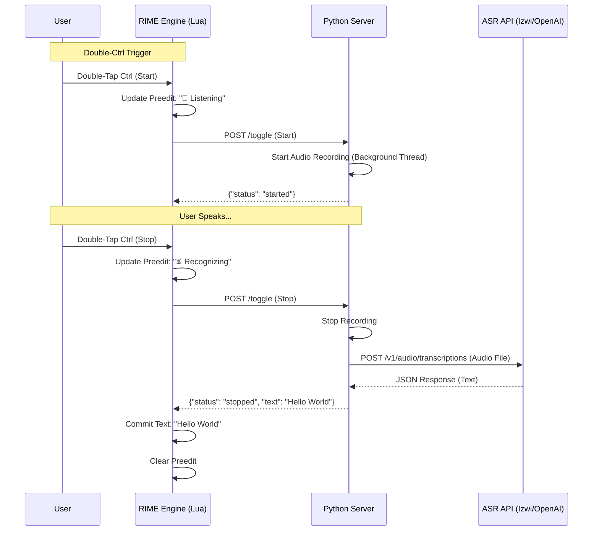

# Technical Design Documentation

This document outlines the architecture and implementation details of the RIME Voice Dictation Plugin.

## Architecture Overview

The system consists of three main components working in tandem:

1.  **RIME Input Method Engine**: The host environment running the Lua plugin.
2.  **Lua Plugin (`rime_dictation.lua`)**: A lightweight frontend that intercepts key events and communicates with the local server.
3.  **Python Helper Server (`dictation_server.py`)**: A local HTTP server that handles audio recording and communicates with OpenAI-compatible ASR APIs.

### System Interaction Diagram

## Component Details

### 1. Lua Plugin (`rime_dictation.lua`)

This script is loaded by RIME as a `processor`. Its primary responsibilities are:

*   **Key Event Interception**: Monitors `Control` key releases (`0xffe3`, `0xffe4`).
*   **Double-Click Detection**: Uses `os.clock()` to measure the time interval between key releases. If < 1 second (configurable), it triggers the dictation toggle.
*   **UI Feedback**:
    *   Uses `env.engine.context.input` to show status messages ("Listening", "Recognizing") in the candidate window's preedit area.
    *   This ensures the UI is responsive without blocking the main thread.
*   **Server Communication**: Sends synchronous `curl` requests to `localhost:8081/toggle`.
    *   *Note*: While `io.popen` is blocking, the local server responds immediately for "Start" and only blocks on "Stop" (waiting for ASR), which is acceptable for the user experience as they expect a pause for recognition.

### 2. Python Helper Server (`dictation_server.py`)

A lightweight HTTP server based on `http.server`.

*   **Audio Handling**: Uses `sounddevice` and `scipy.io.wavfile` to record audio from the default microphone.
    *   **Auto-Detection**: Automatically detects the device's supported sample rate to avoid PortAudio errors.
*   **State Management**: Maintains a simple state machine (`recording` vs `idle`).
*   **API Client**: Uses the `requests` library to send the recorded `.wav` file to an OpenAI-compatible endpoint.
    *   **Authentication**: Supports `OPENAI_API_KEY` environment variable.
    *   **Configuration**: `ASR_API_URL` and `ASR_MODEL` can be customized via environment variables.

### 3. ASR Backend

The system is designed to be backend-agnostic. It works with any service implementing the OpenAI Audio Transcription API:

*   **Endpoint**: `POST /v1/audio/transcriptions`
*   **Parameters**: `file` (audio binary), `model` (string).
*   **Recommended**: [Izwi](https://github.com/agentem-ai/izwi) for local, private, and fast recognition, or OpenAI's Whisper API.

## Data Flow

1.  **Trigger**: User double-taps `Ctrl`.
2.  **Signal**: Lua sends HTTP POST to Python.
3.  **Recording**: Python server starts recording audio to a memory buffer or temporary file.
4.  **Stop**: User double-taps `Ctrl` again.
5.  **Processing**: Python server stops recording, saves `dictation.wav`.
6.  **Transcribing**: Python server sends `dictation.wav` to the configured ASR API.
7.  **Result**: API returns text.
8.  **Output**: Python server returns JSON `{"text": "..."}` to Lua.
9.  **Display**: Lua script commits the text to the RIME engine, inserting it into the active application.
